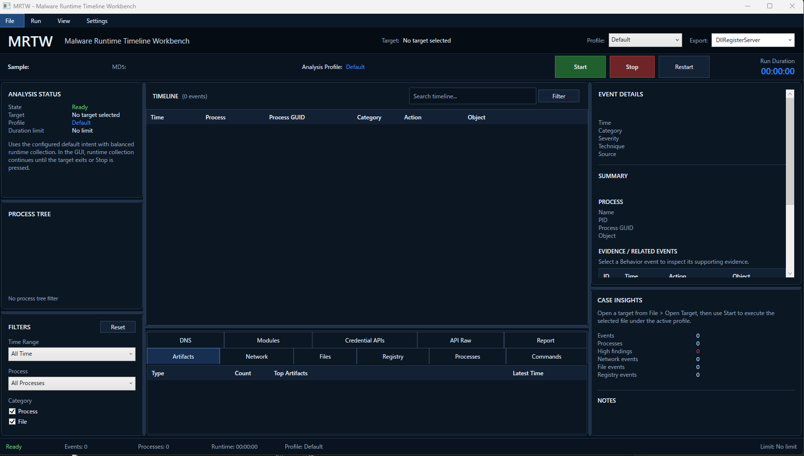

# MRTW — Malware Runtime Timeline Workbench

## 現在実装されている機能

### 静的解析

- MD5 / SHA-1 / SHA-256、ファイルサイズ、PEアーキテクチャ、タイムスタンプ
- エントリーポイント、Subsystem、Image Base、Overlayサイズ
- Import / Export、Section、Resource、TLS Callback、PDBパス
- .NETメタデータとAuthenticode署名の簡易検出
- URL、ドメイン、ファイルパス、レジストリパス、PowerShell文字列などの抽出
- 静的解析結果のHTML / JSON / CSV出力

### 動的解析

- 対象プロセスの起動、終了、タイムアウト、プロセスツリー制御
- GUI/CLI共通の収集オーケストレーター
- ETW（TraceEvent）による対象プロセスと子孫プロセスのProcess・ImageLoad・TCP・DNSイベント収集
- 実行前後のファイル、レジストリ、TCP接続スナップショット差分
- x64 Native Hookによるファイル、レジストリ、プロセス、ネットワーク、認証情報、回避・探索系APIなどの観測
- Named Pipe経由のHookイベント取り込み
- Hookアダプタ単位の初期化結果、Pipe受信数、Parse/接続失敗の自己診断
- UTC取得時刻による収集イベントの正規化、Process GUID付与、重要度分類、Behavior相関
- Runtime / Hook / ETWごとの収集状態、イベント数、欠落数、エラーを含むCollection Quality
- Windows Firewallによる `observe` / `block` / `isolated` ネットワークモード
- EXE、DLL（既定では `rundll32`）、任意コマンドラインの実行
- `--execute off` による非実行分析

Native Hookバイナリが存在しない場合、対応外の対象の場合、または注入に失敗した場合は、標準実行と利用可能なテレメトリへフォールバックします。Windowsのシェル/AppXランチャーと判定された対象では、正常なアプリ引き渡しを妨げないためHook注入を省略する場合があります。

### WPF GUI

- EXE/DLLの選択、静的解析、実行、停止、再実行
- Quick / Full Captureプロファイル
- 実行中のタイムラインとETWイベントのライブ表示
- 時間、プロセス、カテゴリ、全文検索によるフィルタリング
- プロセスツリー、Artifacts、Network、Files、Registry、Processes、Commands、DNS、Modules、Credential APIs表示
- Behaviorイベントと根拠イベントの関連表示
- `case.json` / `case.sqlite` の読み込みと最近のケース一覧
- HTML / CSV / JSON / JSONL / SQLite / ZIPエクスポート、Privacy Mode
- GUI、HTMLレポート、JSON、SQLiteでのCollection Quality表示・保存

GUIとCLIは同じ `AnalysisOrchestrator` を使用します。CLIの `--etw on` も通常のケース収集へ統合され、GUIだけにETWイベントが存在する差異はありません。

## 必要環境

- Windows 10/11 x64
- .NET SDK 9.0
- Visual Studio 2022 または Build Tools（.NETデスクトップビルドツール）
- Native Hookをビルドする場合:
  - CMake 3.24以上
  - Visual Studio 2022 C++ビルドツール
  - Windows SDK
  - MinHook取得用のインターネット接続

ETWプロバイダーや対象プロセスの権限によっては、MRTWを管理者として起動する必要があります。Native Hookは現在x64対象のみです。

## ビルド

PowerShellでリポジトリルートから実行します。

```powershell
$env:DOTNET_CLI_HOME = "$PWD\.dotnet-home"
dotnet restore MRTW.sln --configfile NuGet.Config
dotnet build MRTW.sln --no-restore
```

### Native Hook / Injector

```powershell
cmake --preset msvc-x64 -S src\MRTW.Native
cmake --build --preset msvc-x64-release
```

生成される `hook_x64.dll` と `injector_x64.exe` は、後続の .NET ビルド時にGUI/CLIの出力先にある `native\` へコピーされます。そのため、Nativeビルド後にもう一度 `dotnet build` を実行してください。

## GUIの起動



```powershell
dotnet run --project src\MRTW.App
```

基本的な操作手順:

1. `File > Open Target` からEXEまたはDLLを選択します。
2. `Quick` または `Full Capture` を選択します。
3. DLLの場合は実行するExport関数を確認します。
4. `Start` を押して解析を開始します。
5. 対象の終了を待つか、`Stop` で収集を終了します。
6. `Export` からケースを保存します。

GUIの実行時間に固定上限はありません。対象が終了するか、ユーザーが停止するまで収集します。GUIからのエクスポート先はアプリ出力ディレクトリ配下の `out\` です。

GUIの応答性を保つため、実行前後の各スナップショットは最大2,000ファイルまたは8秒で打ち切ります。`Stop` はスナップショット中でも受け付け、実行前に停止された場合は対象プロセスを起動しません。ライブのタイムライン更新はまとめて画面へ反映し、完全なBehavior相関・プロセスツリー・アーティファクト集計は収集終了時に確定します。静的解析は入力全体を安全に解析するため256 MiBまでであり、それを超える対象は解析前に拒否します。

ライブUIキューはイベント10,000件・ネットワーク2,000件、Hookパイプは行64 KiB・保留4,096件に制限されます。上限超過は画面またはHook Transport Summaryに記録され、収集処理を無制限にメモリ消費させません。実行直前には静的解析時のSHA-256と再照合し、検体が差し替わっていれば起動を拒否します。抽出文字列も候補長4,096文字・候補数512件に制限されます。

画面上のライブ履歴も10,000件に制限され、古い表示イベントを破棄した数は画面に表示されます。これはGUI表示だけの制限であり、最終ケースは収集器が保持した完全なイベント列から確定します。

SHA-256照合に成功したEXE/DLLは、通常実行およびNative Hook実行では起動判断が完了するまで書換え・削除を許さない読み取りハンドルを保持します。UAC昇格のShellExecute経路は同じ原子性を保証できないため、整合性照合済みの直接昇格実行は安全側で拒否されます。

## CLIの使い方

ヘルプと環境診断:

```powershell
dotnet run --project src\MRTW.Cli -- --help
dotnet run --project src\MRTW.Cli -- version
dotnet run --project src\MRTW.Cli -- doctor
```

### 静的解析のみ

```powershell
dotnet run --project src\MRTW.Cli -- static `
  --target C:\Samples\sample.exe `
  --out out\static `
  --format html,json,csv
```

### 動的解析

```powershell
dotnet run --project src\MRTW.Cli -- run `
  --target C:\Samples\sample.exe `
  --duration 60 `
  --out out\cases `
  --format all `
  --auto-suffix
```

対象を実行せずにケースを作る場合:

```powershell
dotnet run --project src\MRTW.Cli -- run `
  --target C:\Samples\sample.exe `
  --execute off `
  --out out\cases `
  --format all
```

DLLのExportを指定する場合:

```powershell
dotnet run --project src\MRTW.Cli -- run `
  --target C:\Samples\sample.dll `
  --type dll `
  --runner rundll32 `
  --export-func DllRegisterServer `
  --out out\cases
```

主な `run` オプション:

| オプション | 内容 |
| --- | --- |
| `--target <path>` | EXE/DLLのパス |
| `--cmd <commandline>` | 任意のコマンドライン。`--target`の代わりに指定可能 |
| `--profile quick\|full-capture` | 組み込みプロファイル |
| `--duration <seconds>` | CLIでの収集時間 |
| `--execute on\|off` | 対象を実行するかどうか |
| `--etw on\|off` / `--hook on\|off` | 収集方式の切り替え |
| `--snapshot-before on\|off` / `--snapshot-after on\|off` | スナップショット取得 |
| `--network observe\|block\|isolated` | 通信監視、対象ホスト送信遮断、または解析中のマシン全体の送受信遮断 |
| `--timeout-action kill\|stop` | タイムアウト時の処理 |
| `--kill-tree` | 終了時にプロセスツリーを対象にする |
| `--format <list>` | `html,csv,json,jsonl,sqlite,zip` または `all` |
| `--privacy-mode on\|off` | エクスポート時にユーザー名などをマスク |
| `--include-sample on\|off` | ケースへ検体を含める。既定はoff |
| `--include-raw on\|off` | Raw JSONLを含める。既定はon |
| `--compress on\|off` | ZIP生成の有効化 |
| `--case-name <name>` | ケース名を明示指定 |
| `--overwrite` / `--auto-suffix` | 出力先衝突時の挙動 |
| `--config <path>` | 設定ファイルを指定 |
| `--log-format json` | CLIログをJSONで出力 |

ネットワークモード:

- `observe`: 通信を変更せず観測します。既定値です。
- `block`: EXEでは対象EXE、DLLでは `rundll32.exe`、任意コマンドでは `cmd.exe` の送信を一時的なWindows Firewallルールで遮断します。
- `isolated`: 解析中にマシン全体の送受信を一時的なWindows Firewallルールで遮断します。専用VMで使用してください。

`block` と `isolated` は管理者権限を必要とします。ルールを作成できない場合は、通信可能な状態で処理を続行せず、検体の実行を拒否します。通常終了、タイムアウト、ユーザー停止、例外のいずれでも一時ルールの削除を試みます。

### ケース操作と診断

```powershell
# ケース一覧
dotnet run --project src\MRTW.Cli -- list --workspace out\cases

# 既存ケースを再エクスポート
dotnet run --project src\MRTW.Cli -- export `
  --case out\cases\<case-name>\case.sqlite `
  --out out\exports `
  --format all

# ETWの利用可否を確認
dotnet run --project src\MRTW.Cli -- etw-smoke --duration 3

# EXE/DLLをディレクトリ単位で処理
dotnet run --project src\MRTW.Cli -- batch `
  --input C:\Samples `
  --recursive `
  --max-samples 10 `
  --out out\cases

# 対象を実行しない自己診断ケース
dotnet run --project src\MRTW.Cli -- selftest --out out\selftest
```

`open` コマンドはケースの存在を検証してパスを表示します。現時点ではGUIを自動起動しません。

## ケース出力

`--format all` では、指定内容と利用可能なデータに応じて次のファイルを生成します。

| ファイル | 内容 |
| --- | --- |
| `case.json` | ケース全体のJSON表現 |
| `sample_metadata.json` | 静的解析メタデータ |
| `events.jsonl` / `raw_events.jsonl` | 正規化イベント / Rawイベント |
| `timeline.csv` | タイムライン |
| `artifacts.csv` | 抽出Artifact |
| `processes.csv` | プロセス情報 |
| `network.csv` | ネットワークセッション |
| `report.html` | 自己完結型HTMLレポート |
| `case.sqlite` | GUI/CLIから再読込できるSQLiteケース |
| `case_export.zip` | 圧縮されたケース一式 |
| `manifest.json` | 出力ファイル一覧とSHA-256 |
| `tool_version.txt` | MRTWバージョン |

Privacy Modeは、出力へ含まれるユーザープロファイル名などをマスクします。`--include-sample on` は検体そのものを出力へ含めるため、共有前に必ず内容を確認してください。

## 設定ファイル

CLIは次の順序で設定を探します。

1. `--config` で指定したファイル
2. カレントディレクトリの `config.yaml`
3. `%APPDATA%\MRTW\config.yaml`
4. 組み込み既定値

現在のパーサーが読み取るのは単純なトップレベルキーです。

```yaml
workspace: "%LOCALAPPDATA%\MRTW\Workspace"
exports: "%LOCALAPPDATA%\MRTW\Exports"
default_profile: "full-capture"
log_format: "text"
quiet: false
verbose: false
```

組み込みプロファイル:

- `quick`: 30秒、ETW有効、Hook無効、前後スナップショット有効
- `full-capture`: 120秒、ETW/Hook有効、前後スナップショット有効、全形式出力

## 検証用サンプル

`test\` には危険な動作を行わない検証用プロジェクトがあります。

- `SafeRuntimeProbe`: 一時ファイル、HKCUレジストリ、DLLロード、COM、localhost通信、子プロセスの観測確認
- `SyntheticBehaviorCase`: 危険な動作を実行せず、UI/Behavior相関確認用の合成ケースを生成
- `StaticAnalysisProbe`: URL、ドメイン、レジストリパスなどの静的解析マーカーを埋め込んだ検体
- `NativeExportProbe`: DLL Export解析と `rundll32` 実行選択の確認
- `NativeSafeRuntimeProbe`: Native Hook観測用の安全なネイティブ検体

詳細は [`test/README.md`](test/README.md) を参照してください。

## リポジトリ構成

```text
src/
  MRTW.App/             WPF GUI
  MRTW.Cli/             コマンドラインUI
  MRTW.Core/            モデル、静的/動的解析、ケース保存、エクスポート
  MRTW.Collectors.Etw/  TraceEventベースのETW Collector
  MRTW.Native/          x64 Hook DLLとInjector
docs/                   アーキテクチャ、イベントモデル、安全上の注意
test/                   安全な検証用プロジェクトとテスト資産
```

補足資料:

- [`docs/architecture.md`](docs/architecture.md)
- [`docs/event_model.md`](docs/event_model.md)
- [`docs/ui_spec.md`](docs/ui_spec.md)
- [`docs/build.md`](docs/build.md)
- [`docs/safety.md`](docs/safety.md)